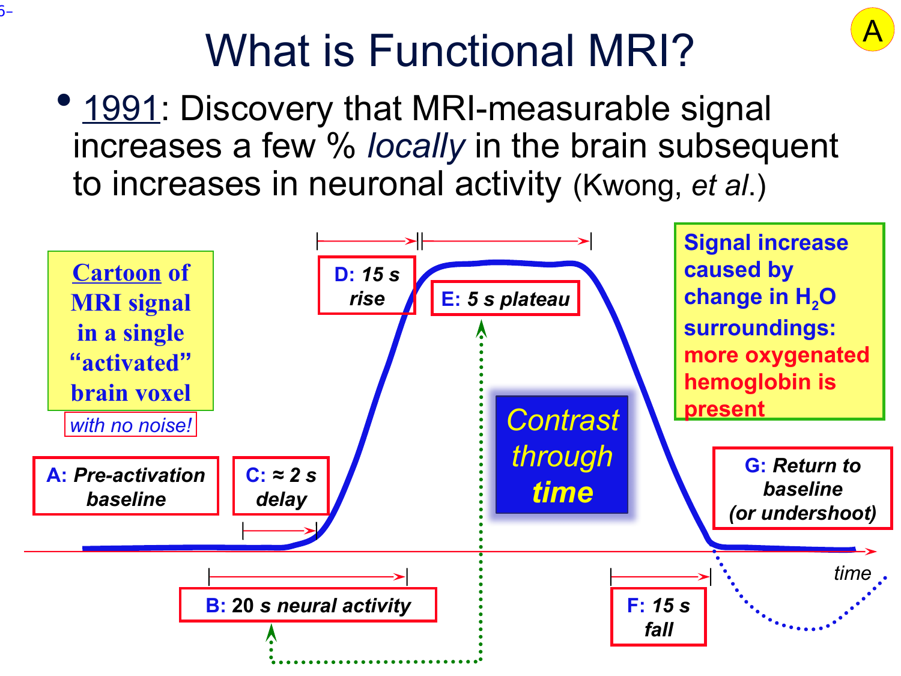
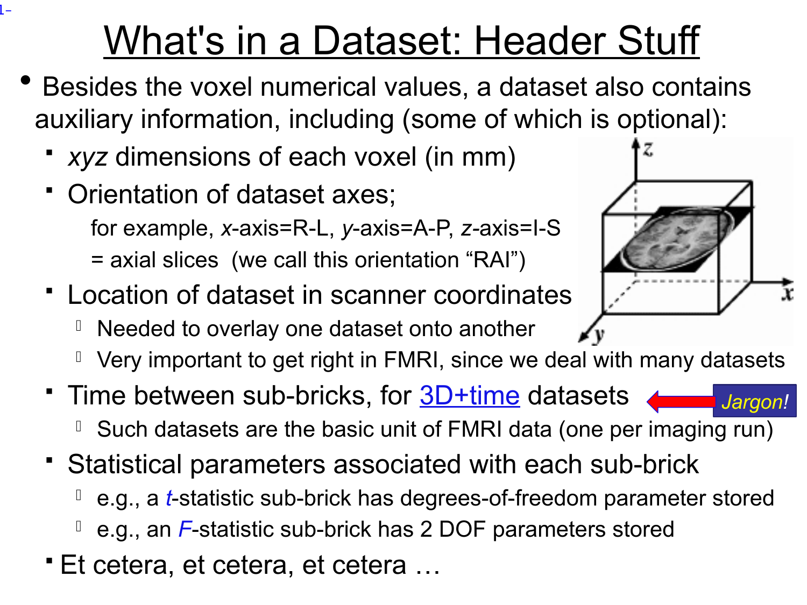
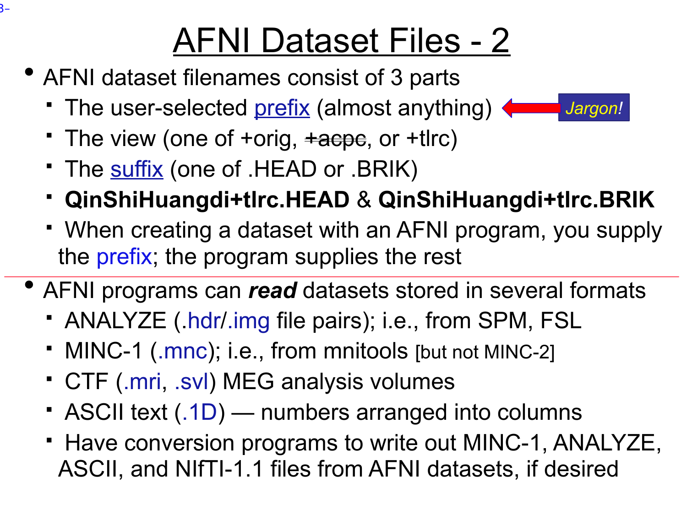
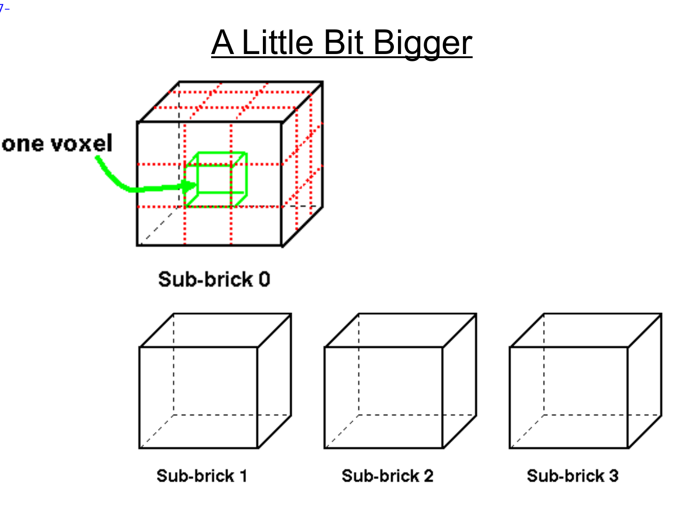

# Lecture 1 — Intro to AFNI and FMRI Data

**Official PDF:** [afni01_intro.pdf](https://afni.nimh.nih.gov/pub/dist/edu/data/CD.expanded/afni_handouts/afni01_intro.pdf)

This is the lecture where we *don't* open the GUI yet. Before any of AFNI's tools make sense, you need to know two things: (1) what signal AFNI is built to analyze (BOLD, its shape in time, and how we find it), and (2) how AFNI represents that signal on disk and in memory. Everything in later lectures — the viewer, regression, alignment, group analysis — is just navigation on top of those two things.

---

## What AFNI is (the 90-second version)

- Written by **Bob Cox** (SSCC, NIMH) starting in **1994**. Still actively developed.
- Name confusion to resolve up front: **AFNI** means two things.
    - Lowercase `afni` — a single GUI program (the viewer).
    - Uppercase AFNI — the full software package: 750+ command-line tools plus the viewer.
- Free, open source (GPL-2), [on GitHub](https://github.com/afni/AFNI).
- Design principles you'll feel throughout the week:
    - Stay close to the data. Every intermediate is inspectable — no black boxes.
    - Give you the pieces, not a policy. You assemble the pipeline.
    - Educate aggressively (that's why this bootcamp exists).

!!! note "Compared to FSL / SPM / MRtrix"
    FSL and SPM ship more opinionated pipelines — "here is *the* way." AFNI gives you sharp tools and expects you to learn how they combine. Steeper initial curve, more control at the end.

---

## What BOLD actually is (the signal AFNI analyzes)

MRI doesn't measure neurons. It measures water — specifically, how hydrogen nuclei (protons) in water behave in a magnetic field. When a brain region works harder, the local blood flow increases a few seconds later. More blood = more oxygenated hemoglobin relative to deoxygenated hemoglobin. That shift changes the local magnetic susceptibility, which changes the MRI signal by **a few percent**.

Key takeaways, because they shape every design decision later:

1. **BOLD is indirect.** You're not seeing neurons firing. You're seeing a blood-flow proxy for neuronal activity. Anything else that changes blood flow (caffeine, breathing, heart rate, vascular anatomy) also moves the signal.
2. **The signal is tiny.** A few percent. Everything that follows — motion correction, nuisance regression, careful design — exists because this signal is fighting physiological noise and scanner drift of similar magnitude.
3. **It's slow.** The blood response lags neural firing by ~2 seconds and persists for ~30 seconds. This is the single most constraining fact about fMRI.

That "slow, smeared-out blood response" has a characteristic shape. Meet it now:

---

## The hemodynamic response function (HRF) — see the shape

{ width=600 }

Look at that blue curve. You need to internalize this shape — it shows up *everywhere* in fMRI.

Read it left-to-right:

| Letter | What's happening |
|:-:|---|
| **A** | Baseline — neuron at rest, BOLD at resting level |
| **B** | Neurons are firing (20 seconds' worth, in this cartoon) |
| **C** | ~2 second delay before blood even *starts* to respond |
| **D** | BOLD climbs over ~15 seconds |
| **E** | Plateau — near-peak for ~5 seconds |
| **F** | BOLD falls over ~15 seconds |
| **G** | Often a brief undershoot *below* baseline before recovery |

So: a stimulus that lasts 20 seconds produces a BOLD response that takes ~30 seconds to play out. That's why fMRI experiments are designed with long blocks or with spaced events — faster than that and the responses run into each other (we'll come back to this).

!!! tip "The single most useful fact on this page"
    The BOLD response to an event lasts ~30 seconds. The neural event itself might be milliseconds. **You are always looking at a smeared, delayed echo.**

---

## What is this whole pipeline *for*?

Zoom out. Before getting into the arithmetic of convolution or regression, you need to know why any of it exists. Here's the full picture.

### What task fMRI studies actually try to answer

Real research questions look like:

- **Where** in the brain does face processing happen? (localize a function)
- **Do patients** with depression activate amygdala more than controls during threat? (group difference)
- **Does anxiety score** predict activation strength in a particular region? (correlation with a continuous trait)
- **Did** prefrontal activation during a memory task change after a training intervention? (within-subject, across sessions)
- **Is** activation during hard math problems *different from* activation during easy ones? (within-subject contrast)

Every one of those questions ultimately gets answered *across subjects*, with group-level statistics. But every one of them needs, as an input: per subject, per voxel, per condition, **a single number that says how strongly that voxel responded to that condition in that subject**.

That single number is what the HRF + convolution + regression pipeline produces. It's called **β**. Everything that comes later — group maps, between-group tests, correlations with behavior, within-subject changes over time — operates on those β numbers.

So the job of the whole subject-level pipeline is narrow: **take each voxel's noisy 152-timepoint signal, per condition, and reduce it to one summary number (β) and an uncertainty (SE, t).**

### Why we build a *predicted* BOLD at all

To boil down a voxel's timeseries to "how much did it respond," we need to compare what it actually did to what it *should have done* if it were responsive. If the two look similar, the voxel is responsive. If not, it isn't.

What a responsive voxel should have done depends on two things:

1. **The experiment you ran** — when each condition was on, when each event happened.
2. **The physiology of BOLD** — blood flow takes seconds to respond and tens of seconds to clear. The signal is a smeared-out, delayed echo of the underlying neural activity.

If you just compared the voxel to your stimulus timeline directly (a 20-s-on / 20-s-off square wave), the match would be poor *even for genuinely responsive voxels* — because the actual BOLD signal doesn't look like a square wave. It looks like a rounded, delayed, smeared thing. The square-wave predictor has the wrong shape.

What you want is a predictor that has the *right* shape for what BOLD actually does. You get that by taking your stimulus timeline and running it through the HRF — i.e., computing what BOLD *would* look like in a voxel that cared about this stimulus, given how slow and smeared BOLD is.

That's the entire point of HRF convolution: **build a per-subject, per-condition predicted BOLD timeseries that has the right shape to match what responsive voxels would actually produce**, so that a regression against it can recover a meaningful amplitude β.

Without HRF convolution, the regression would systematically underestimate β at responsive voxels (square-wave predictor vs. rounded signal = poor fit = small estimated amplitude) and you'd miss most of your real activation.

### The three stages of a task fMRI analysis

This is the skeleton underneath *every* task fMRI study:

**Stage 1 — Subject-level fit.** For each subject, at each voxel, regress the measured BOLD against HRF-convolved predictors (one per condition) plus nuisance regressors. Output: β maps and t maps, per condition, per subject. **This is the only stage where the HRF enters.** AFNI's `3dDeconvolve` does this.

**Stage 2 — Subject-level contrasts (optional).** Within each subject, combine condition βs into contrasts — e.g. β(faces) − β(houses), or β(hard) − β(easy). Still one number per voxel per subject, now representing a difference between conditions. `3dDeconvolve` supports contrast specifications via `-gltsym`.

**Stage 3 — Group analysis.** Feed Stage 1 βs (or Stage 2 contrasts) into a statistical test across subjects. This is where the actual research questions get answered:

| Research question | Stage-3 test | AFNI tool |
|---|---|---|
| "Is this area reliably activated in the population?" | One-sample t-test on βs across subjects, per voxel | `3dttest++` |
| "Do patients vs controls differ in activation?" | Two-sample t-test on βs | `3dttest++ -setA -setB` |
| "Does anxiety score predict amygdala β?" | Voxelwise regression of βs on the trait | `3dttest++ -covariates`, `3dMVM` |
| "Did activation change after training?" | Paired t-test on session-2 β − session-1 β | `3dttest++ -paired` |
| "Interaction of condition × group × time?" | Mixed-effects model | `3dLME`, `3dLMEr` |

**Stages 2 and 3 do not involve the HRF.** They operate on numbers (βs) that Stage 1 already produced. The HRF's entire job is at Stage 1, and its role is specifically to give the regression a correctly-shaped predictor so β is a clean estimate of amplitude.

So to answer the question directly: **HRF is not only for "does this voxel activate, yes/no."** The β it helps produce is the raw material for *every* kind of task-fMRI question — group maps, between-group differences, individual-differences correlations, within-subject changes over time. But the HRF itself enters only at the subject-level regression. After that, the analyses are just arithmetic on β maps.

---

## Convolution — the actual arithmetic

Now, with that purpose in hand, the mechanics of how Stage 1 builds its predicted BOLD.

### The assumption that makes it tractable

Two empirical properties of the BOLD response:

- **Linearity**: doubling a stimulus's intensity or duration roughly doubles the magnitude of the BOLD response.
- **Additivity**: if two stimulus events happen close together, the BOLD response to both is (approximately) the sum of the individual responses — the HRFs each event triggers overlap and add.

Together these are the **linear time-invariant (LTI) assumption**. Not exactly true — BOLD saturates at very short intervals or very intense stimulation — but close enough across normal experimental ranges.

Under LTI, the predicted BOLD is a specific calculation on two timeseries.

### The setup

Represent both the stimulus and the HRF as columns of numbers, sampled at the TR grid (every 2 seconds in the FT example):

```
stimulus[0], stimulus[1], stimulus[2], ...    ← 1 if on at that TR, 0 if off
                                                (or a continuous value for graded stimuli)

hrf[0], hrf[1], hrf[2], ..., hrf[L-1]         ← the HRF shape, L values (~15 at TR=2s
                                                since the HRF is ~30 s long)
```

The HRF values start near 0, climb to a peak around `hrf[3]` (≈ 6 s post-event), fall back, dip slightly negative in the undershoot, and return to 0 by the end.

### The computation

The predicted BOLD at timepoint `k` is this sum:

```
predicted[k] =   stimulus[k]   * hrf[0]
               + stimulus[k-1] * hrf[1]
               + stimulus[k-2] * hrf[2]
               + ...
               + stimulus[k-(L-1)] * hrf[L-1]
```

In words: **at timepoint k, walk backward through the stimulus up to L TRs. Each past stimulus tick contributes its value times the HRF at the matching lag. Sum them all.**

Do this for every `k` — the result is a new timeseries the same length as the input. That's the predicted BOLD.

This specific arithmetic procedure — "at every output time, sum stimulus values times HRF-at-the-appropriate-lag over the HRF's duration" — is what **convolution** is. When a paper or docs page says "the stimulus is convolved with the HRF," this sum is the computation.

### Why the predicted BOLD doesn't look like the stimulus

Take a stimulus that's on for 20 seconds at TR = 2 s: stimulus values `[0, 0, 0, 0, 0, 1, 1, 1, 1, 1, 1, 1, 1, 1, 1, 0, 0, 0, ...]`. Walking through the procedure:

- **First on-tick of the block.** Only the current tick contributes, weighted by `hrf[0]` ≈ 0. Predicted BOLD is barely above baseline.
- **Two TRs in.** Two ticks contribute, both in the HRF's early rising portion. Predicted BOLD climbing.
- **Mid-block.** Many ticks contribute. Earliest ones multiply near-peak HRF values; latest ones multiply still-climbing HRF values. Sum is large and still rising slowly.
- **End of block.** Stimulus goes off (new ticks contribute 0), but the on-ticks from the block are still playing out — most near or past their peak. Predicted BOLD near plateau.
- **5–10 s after block.** No new contributions, and the earlier ones are now past their peaks. Predicted BOLD falls.
- **20–30 s after block.** Earliest on-ticks have entered the HRF's undershoot phase; their contributions are slightly negative. Predicted BOLD briefly dips below baseline.
- **After that.** All contributions decayed. Back to baseline.

The net shape is a rounded rise, rounded plateau, rounded fall, small undershoot — not a square wave. (You'll see this concretely in the red curve of the figure two sections down.)

---

## How the HRF shapes experimental design

Because responses last ~30 seconds and overlap additively, two design choices are directly constrained by the HRF shape — before you ever scan a subject.

### Event spacing

If two stimulus events are less than ~4 seconds apart, their predicted BOLD timeseries are nearly indistinguishable after convolution — the regression can't separate event A's response from event B's. Reliable separation requires either:

- At least ~5–6 seconds between events of *different* types (event-related design with jittered inter-stimulus intervals), or
- Long homogeneous blocks (~20–30 s per condition) so the within-block overlap reaches a plateau you can compare across conditions (block design).

### Block vs. event-related vs. mixed

- **Block design.** Long periods of one condition alternating with long periods of another (e.g. 20 s faces / 20 s houses, repeating). The predicted BOLD reaches a near-plateau during each block. Pros: large, sustained signal — easy to fit, highly powered. Cons: only tells you about *condition-level* differences; you can't pull out responses to individual trials.
- **Event-related design.** Brief stimuli (~1 s) in random order with varied inter-stimulus intervals. You need many more events per condition to build power, but you can ask about trial-to-trial variation, order effects, novelty, and event-specific responses.
- **Mixed design.** Blocks of task vs. rest, with individual events inside task blocks. Lets you decompose sustained (block-level) and transient (event-level) effects in the same dataset.

In every case: your design choice determines the stimulus timeline; the HRF-convolved version of that timeline is what Stage 1 compares against the measured signal at each voxel.

---

## Fitting Stage 1 at each voxel — β, SE, t

At each voxel you have two timeseries:

- `measured[t]` — what this voxel actually recorded. Noisy, drifting, contaminated by motion and physiology.
- `predicted[t]` — the stimulus convolved with the HRF (one of these per condition). Same length, same TR grid.

The fit at every voxel is a linear regression:

```
measured[t] = β × predicted[t] + (nuisance regressors) + noise[t]
```

Three quantities per voxel come out:

- **β (beta)** — the scale factor on the predicted signal. "At this voxel, when the predicted signal goes up by 1 unit, the measured signal goes up by β units." A large β means the voxel responds strongly to this condition.
- **SE(β) — standard error of β** — how uncertain β is given the noise in this voxel's data. Long scans and clean voxels have small SE; short scans and noisy voxels have large SE.
- **t-statistic: t = β / SE(β)** — how many standard errors β sits away from zero. Large |t| means β is unlikely to be explained by noise alone.

The single-subject **activation map** is the t-statistic at every voxel, thresholded, colored, and overlaid on anatomy. But remember — this map is not the end goal. It's a Stage 1 output. The β at every voxel is what gets fed into Stage 3 group analysis across subjects.

{ width=700 }

Look at the image. Red = predicted BOLD for a 27-s-on / 27-s-off block paradigm — note its rounded shape (the block stimulus was a square wave; the HRF convolution smoothed it). Black = this voxel's measured signal — noisy but visibly tracking the red. Blue = the regression's fit: `β × red` plus fitted nuisance terms. That blue hugs black is why we'd call this voxel activated — and the β at this voxel would be one of the numbers fed to Stage 3.

### Nuisance regressors

The "`(nuisance regressors)`" slot in the formula isn't a single term. It's a set of additional timeseries fit alongside the predicted BOLD — each gets its own β, estimated from the same regression. Every task-fMRI regression includes:

- **Motion parameters (6 columns)** — three translations and three rotations from motion correction. These absorb signal changes driven by head movement so those changes don't get falsely attributed to your stimulus.
- **Polynomial drift terms** — low-order polynomials per scan run, absorbing slow scanner drift (minutes-scale intensity changes unrelated to the task).
- **Run indicators** — per-run baseline offsets, so each run is normalized independently.
- **Censor spikes** (optional) — one-off regressors for individual high-motion or outlier timepoints, effectively removing them from the fit.

These are not separate preprocessing steps. They are *columns in the same regression as the stimulus predictor*. Their βs are estimated and the variance they explain is removed from the estimate of the stimulus β. This is why it's called "nuisance regression" even though it isn't run as its own step.

---

## What `3dDeconvolve` does

`3dDeconvolve` is AFNI's implementation of Stage 1. Given a preprocessed EPI, stim timing files, and a choice of HRF shape, it produces β and t maps at every voxel for every condition and contrast, in one command. Lecture 2 is the deep dive; here's the shape.

**Inputs you give it**

- The preprocessed BOLD dataset (4D — one sub-brick per TR).
- One or more **stim timing files**: plain-text files listing when events of each condition occurred (in seconds, relative to each run's start).
- A specification of the **HRF shape** to use. Options include a canonical single-peak shape (`GAM`, `SPMG1`, `BLOCK`) or a flexible data-driven shape estimated from the data itself (`TENT`, `CSPLIN`).
- Optional: motion regressors, censoring files, polynomial drift order, and contrasts between conditions (`-gltsym` specifications — these are the Stage 2 combinations).

**What it does inside**

1. For each stim timing file, builds the stimulus timeseries on the TR grid and convolves it with the HRF — producing one predicted BOLD timeseries per condition (the regressors of interest).
2. Adds the nuisance regressors: motion (6), polynomials for drift (3–5 per run), per-run indicators, censor spikes.
3. Stacks all regressors into a **design matrix**: one row per timepoint, one column per regressor.
4. At every voxel, solves a least-squares regression — finds the β-vector that minimizes the squared difference between `(design matrix) × β` and that voxel's measured BOLD timeseries.
5. Computes SE and t-stat for each β, the overall F-stat for the model, and t-stats for any contrasts you specified.

**Outputs**

- A `stats.*+tlrc` dataset: one labeled sub-brick per statistical quantity (β, t, F, contrast t's). This is where the sub-brick taxonomy above shows up in real analyses — and these β sub-bricks are what downstream Stage 3 programs will consume.
- The **design matrix itself**, saved as `X.xmat.1D` — a plain-text file you can open and inspect. Lecture 3 is partly about reading these to sanity-check a fit.
- Optional: residuals, fitted timeseries, per-voxel model-fit quality.

**Why "deconvolution"?** You supply the forward model (stimulus timings + HRF shape, which together specify how each condition *would* produce BOLD). The program solves the inverse (what amplitudes best explain the measured BOLD). That forward-then-inverse workflow is historically called deconvolution. The `3d` prefix means it operates on every voxel of a 3D grid.

**Why it's one program, not four.** Stimulus convolution, design-matrix assembly, per-voxel regression, and stats computation are tightly coupled — changing any piece (different HRF, additional nuisance regressor, a new contrast) requires redoing all of them consistently. Bundling them into one program with a well-documented flag set is more robust than chaining four separate tools.

**The output is not the scientific finding.** That β map from `3dDeconvolve` is one subject's data. To answer any of the questions at the top of this section (group activation, between-group differences, correlations with behavior, within-subject change), you run a different program on the collection of βs from many subjects. That's Stage 3, and it's later in the bootcamp.

---

## AFNI's data model — slowly

Now switch gears from signal to data. Everything we just described — voxels, 3D brains, timeseries — has to live somewhere on disk and in memory. Here's how AFNI organizes it.

### Start with one volume

When the scanner produces one 3D image of the head (one anatomical, or one EPI timepoint), what comes out is:

- A **grid of voxels** — for a T1, maybe 256 × 256 × 175 voxels of roughly 1 mm each.
- **One number per voxel** — the signal intensity at that location.

So conceptually: a single cube of numbers.

{ width=400 }

But raw numbers aren't enough. A cube of numbers with no context is meaningless — you can't tell which cube of numbers is *where in the head*. You need extra information. That extra information is called the **header**:

- Voxel size in mm (how big is each little cube).
- Orientation — which direction is x going? Left-to-right? Front-to-back? This is encoded as a 3-letter code like `RAI`.
- Origin in scanner coordinates — where does voxel (0, 0, 0) sit in physical space.
- If there's a time dimension: TR (seconds between volumes).
- Plus labels and stats parameters we'll see shortly.

**Grid of numbers + header = one AFNI dataset.** That's actually it. Hold onto that definition — we're about to extend it.

{ width=600 }

### What if you have more than one volume? (This is the sub-brick idea.)

Now imagine an fMRI run. You're scanning the same head every 2 seconds for 5 minutes. You get 150 separate 3D volumes, indexed by time.

AFNI bundles them into **one** dataset. The 150 volumes inside are called **sub-bricks**, indexed 0, 1, 2, …, 149. Sub-brick #0 is the first volume; sub-brick #149 is the last.

{ width=500 }

That's the picture. **A dataset is a stack of sub-bricks; each sub-brick is a 3D volume; all sub-bricks in a dataset share the same voxel grid.**

### But sub-bricks don't *have* to be time

This is where it generalizes. AFNI uses sub-bricks any time it needs to group multiple 3D volumes that share a grid. Time is just the most intuitive case. Here are the main cases you'll hit:

| What's in the dataset | What each sub-brick represents | How many sub-bricks |
|---|---|:-:|
| An EPI timeseries | One volume = one scanner timepoint (one TR) | 100s |
| A T1 anatomical | Just one volume — the structural | 1 |
| A brain mask | Just one volume — integer labels (0 = background, 1 = brain) | 1 |
| A multi-region ROI atlas | One volume — integer labels, one ID per region | 1 |
| A mean EPI (average across time) | Just one volume — the mean image | 1 |
| A regression output (from `3dDeconvolve`, Lecture 2) | One sub-brick *per statistical quantity*: a β for each regressor, a t-stat for each regressor, an F-stat, etc. | 10s–100s |

The regression case is worth sitting with for a moment. When we run the task-activation regression in Lecture 2, the output isn't "one file of betas and one file of t-stats." It's **one dataset** — e.g. `stats.FT+tlrc` — with a β sub-brick, a t-stat sub-brick, an F-stat sub-brick, and so on, each with a human-readable **label**. You'll reference them by label:

```text
stats.FT+tlrc[Vrel#0_Coef]       ← the β for the "visual reliable" condition
stats.FT+tlrc[Vrel#0_Tstat]      ← the t-stat for the same condition
```

Why group them all into one dataset? Because they share a grid, a mask, and a provenance (they all came from the same regression run). Splitting them into separate files means bookkeeping later to keep them in sync. Bundling them in one dataset is AFNI's way of saying "these numbers belong together."

### Image dataset vs. derived dataset

The last conceptual split. The voxel values in a dataset can come from two places:

- **Image dataset** — the numbers are scanner intensities. Examples: `FT_anat+orig` (one T1 scan), `FT_epi_r1+orig` (152 EPI volumes). These are what the scanner produced, possibly after conversion from DICOM.
- **Derived dataset** — the numbers are computed from other datasets. Examples: a brain mask (1 where brain, 0 where not), a mean EPI (mean across time), a t-stat map (output of regression).

AFNI does not care which kind you hand it. `3dinfo`, `3dcalc`, the GUI, the arithmetic — they all operate uniformly on any dataset. "Image" vs "derived" is a provenance distinction for the human, not a file-format distinction.

### Indexing sub-bricks at the shell

Last vocab piece. To reference sub-brick 3 of a dataset at the shell:

```bash
dataset_name+view'[3]'
```

Two important bits:

1. `+view` is part of the dataset name — either `+orig` (scanner space) or `+tlrc` (aligned to a template). More below.
2. The single quotes around `[3]` are required. Bash/zsh treat `[` as glob syntax — the quotes tell the shell "leave these brackets alone, they're for AFNI."

You can also use labels where they exist:

```bash
stats.FT+tlrc'[Vrel#0_Coef]'
```

Or ranges: `FT_epi_r1+orig'[0..9]'` grabs the first 10 sub-bricks.

---

## File formats on disk

### BRIK + HEAD (the AFNI native format)

A single AFNI dataset on disk is **two files**:

```text
FT_anat+orig.HEAD     ← ASCII text: the header info (dimensions, orientation, labels, …)
FT_anat+orig.BRIK     ← raw binary: the voxel numbers for all sub-bricks
                        (often .BRIK.gz when compressed)
```

They always travel together. Lose one and the other is useless. When you `cp` or `mv`, take both.

You can `head` the `.HEAD` file — it's plain ASCII key/value records. You generally shouldn't *edit* it by hand (there's a dedicated tool called `3drefit` for that), but you can read it to see what AFNI is storing.

### The "view" tag

Look at the filename — `FT_anat+orig`. The `+orig` is a **view tag**: it says what coordinate system this dataset lives in.

- `+orig` — original scanner space. What the scanner gave you, possibly reoriented.
- `+tlrc` — aligned to a standard atlas (Talairach, MNI, etc.). Moved + rescaled to a common template space so you can compare across subjects.

You typically acquire data in `+orig` and *transform* it into `+tlrc` as part of preprocessing (Lecture 5). For now just know: the view is baked into the filename.

### NIfTI

The rest of the field (FSL, SPM, Python/`nibabel`, BrainVoyager) uses the NIfTI format (`.nii` or `.nii.gz`) — a single file combining header and data. AFNI reads and writes it natively. To make any AFNI program write NIfTI instead of BRIK/HEAD, just end your `-prefix` in `.nii` or `.nii.gz`:

```bash
3dcalc -a FT_anat+orig -expr 'a' -prefix anat_copy.nii.gz    # writes NIfTI
3dcalc -a FT_anat+orig -expr 'a' -prefix anat_copy           # writes anat_copy+orig.HEAD / .BRIK
```

!!! tip "When to use which"
    Stay in BRIK/HEAD inside an AFNI pipeline — richer per-sub-brick metadata (labels, stat params) that NIfTI doesn't cleanly support. Export to NIfTI when you hand data off to a non-AFNI tool or share publicly.

### Other formats

AFNI can *read* ANALYZE 7.5 (`.hdr`/`.img`), MINC-1 (`.mnc`), CTF MEG, and ASCII (`.1D`) — plain-text columns of numbers, which you'll meet when we write stimulus timing files in Lecture 2/3.

---

## AFNI's program landscape

You'll interact with AFNI in three modes:

1. **The GUI** — the program literally named `afni`. Interactive viewer, crosshair, stats overlays. Lectures 3 and 4.
2. **Batch programs** — one-shot command-line tools. *Almost all real work happens here.* Naming convention: programs starting with `3d` operate on 3D datasets (`3dinfo`, `3dcalc`, `3dDeconvolve`, `3dvolreg`, `3dSkullStrip`, …).
3. **Super-scripts** — Python wrappers that chain many `3d*` programs into a full pipeline. Two you'll use constantly:
    - `afni_proc.py` — end-to-end single-subject preprocessing + first-level GLM.
    - `align_epi_anat.py` — EPI ↔ anatomical coregistration (Lecture 5).

!!! tip "This maps directly to your DTI experience"
    Your DTI pipeline was a shell script calling `dwidenoise`, `dwifslpreproc`, `dwibiascorrect`, `dwi2tensor`, etc. `afni_proc.py` is the AFNI analog: each of its flags maps to a specific `3d*` call. Bonus: it writes out the full tcsh pipeline script for you to read, tweak, and rerun. We'll dissect one in Lecture 3.

**A starter set of `3d*` programs** — you don't need to memorize these, but see the naming pattern:

| Program | What it does |
|---|---|
| `3dinfo` | Dump a dataset's header. Your most-used command, hands down. |
| `3dcalc` | Voxel-wise calculator. `3dcalc -a X -b Y -expr 'a-b' -prefix diff` to subtract two datasets. |
| `3dDeconvolve` | Linear regression / GLM on 3D+time data (Lecture 2). |
| `3dREMLfit` | Same GLM with a better (ARMA) noise model. Runs after `3dDeconvolve`. |
| `3dvolreg` | Motion correction — register every sub-brick to a reference. |
| `3dresample` | Re-orient or re-grid a dataset. |
| `3dSkullStrip` | Strip skull from T1. |
| `3dANOVA` / `3dLME` | Group-level statistics. |
| `3dDWItoDT` | DTI tensor fit (AFNI has DTI tools too). |

**SUMA** is worth naming: it's the AFNI *surface* viewer. It renders cortical meshes (from FreeSurfer / BrainVoyager / Caret) and can "talk" to an open `afni` session so clicking in one jumps the other. We won't use SUMA on Day 1.

---

## Hands-on — `3dinfo` on real data

Concepts are set. Now we put eyes on real datasets on the cluster and make the abstractions concrete. This is a ~10-minute exercise.

### 1. Connect to the cluster

From your Mac terminal (Temple VPN connected):

```bash
expect -c '
spawn ssh -o StrictHostKeyChecking=no tur50045@155.247.67.31
expect "password:"
send "Milolab123!\r"
interact
'
```

Inside, confirm AFNI is on `PATH`:

```bash
afni -ver
# → Precompiled binary linux_ubuntu_16_64: May 23 2025 (Version AFNI_25.1.11 'Maximinus')
```

If that errors, `source ~/.bashrc` and try again.

### 2. Walk to the canonical "FT" dataset

"FT" is the example subject you'll see throughout the AFNI bootcamp. Three runs of a visual/auditory paradigm, plus a T1 anatomical.

```bash
cd /data/AFNIBootcamp_2025/CD/AFNI_data6/FT_analysis/FT
ls *.HEAD
# → FT_anat+orig.HEAD  FT_epi_r1+orig.HEAD  FT_epi_r2+orig.HEAD  FT_epi_r3+orig.HEAD
```

Four datasets — one anatomical, three EPI runs. Each has its matching `.BRIK` (or `.BRIK.gz`) right next to it.

### 3. Inspect the anatomical

```bash
3dinfo -verb FT_anat+orig | head -20
```

Look at the output against everything above. You should find:

- `Dataset Type: Anat Bucket (-abuc)` — AFNI has tagged this as an anatomical.
- `Data Axes Orientation: [-orient ASL]` — axes go Anterior-to-Posterior, Superior-to-Inferior, Left-to-Right. Sagittal slicing. (Not every dataset is RAI — real-world orientations are whatever the scanner sat in.)
- `256 × 256 × 175` voxels at `0.938 × 0.938 × 1.000 mm` — near-isotropic, high-res T1.
- `Number of values stored at each pixel = 1` — **one sub-brick.** As expected for a single structural scan.

### 4. Inspect an EPI run

```bash
3dinfo -verb FT_epi_r1+orig | head -25
```

Compare against the anatomical:

- `Dataset Type: Echo Planar (-epan)`.
- `80 × 80 × 33` voxels at `2.75 × 2.75 × 3.0 mm` — much coarser resolution, because we're trading spatial detail for temporal speed.
- `-orient RAI` — different from the anatomical's ASL. Lecture 5 is about reconciling these.
- `Number of time steps = 152  Time step = 2.00000s` — **152 sub-bricks, TR = 2 s.** Scroll the output and you'll see them enumerated: `sub-brick #0`, `#1`, …, `#151`. Each one is a full 3D EPI volume at a different instant in time.

### 5. Extract a specific sub-brick

You can ask questions about a single sub-brick without copying anything:

```bash
3dinfo -nv  FT_epi_r1+orig              # just the number of sub-bricks
3dinfo -tr  FT_epi_r1+orig              # just the TR
3dBrickStat -mean  FT_epi_r1+orig'[0]'    # mean intensity of volume 0
3dBrickStat -mean  FT_epi_r1+orig'[75]'   # mean intensity of volume 75
```

Notice the single quotes around `[0]` — that's shielding the brackets from the shell. Forget them and you'll get a glob error like `no matches found`.

### 6. Read the raw HEAD file

```bash
head -40 FT_anat+orig.HEAD
```

ASCII key/value records. You can see, literally, what AFNI stores. You normally wouldn't edit this by hand — `3drefit` is the tool — but it's useful to know it's just text.

---

## Checkpoint questions

Answer before scrolling back.

1. **Why does the BOLD signal lag the neural event by seconds, even though neurons fire in milliseconds?**

    ??? answer "Show answer"
        BOLD is a *hemodynamic* (blood-flow) proxy, not a direct neural measurement. Blood flow takes ~2 seconds to increase locally after neurons fire, then persists for tens of seconds. You're always seeing a smeared, delayed echo of neural activity.

2. **In one or two sentences, what is the "predicted BOLD timeseries" and how do we get it?**

    ??? answer "Show answer"
        Take your stimulus timeline (on/off at each timepoint) and *convolve* it with the HRF (the canonical rising-plateau-falling shape). That gives you a smoothed, delayed signal representing what a BOLD-responsive voxel *should* look like if it cares about your stimulus.

3. **What is β (beta) at a voxel, and what is t at that voxel? What would a big β with a small t mean?**

    ??? answer "Show answer"
        β is the regression slope — how much of the predicted signal is present in this voxel's measured signal. t is β divided by its standard error — how confident we are that β isn't just noise. Big β with small t means "we estimated a large response, but our uncertainty around that estimate is also large, so we can't rule out zero." Typically happens with short runs or very noisy voxels.

4. **A mask dataset, a T1 anatomical, and an EPI timeseries are all "AFNI datasets." What's the same about them, and what's different?**

    ??? answer "Show answer"
        Same: each is a 3D grid of voxels plus a header, stored as `.HEAD` + `.BRIK`. All AFNI programs (`3dinfo`, `3dcalc`, the GUI) operate on them uniformly. Different: the number and meaning of sub-bricks. Mask and T1 each have one sub-brick (one 3D volume); the EPI has many (one per TR). The voxel values also mean different things (integers for a mask, scanner intensity for the T1, scanner intensity per timepoint for the EPI).

5. **The regression output dataset `stats.FT+tlrc` has ~40 sub-bricks. Why so many, and why are they in one dataset instead of split into separate files?**

    ??? answer "Show answer"
        Regression at each voxel produces several statistical quantities *per predictor* — at minimum a β and a t-stat, often plus an F-stat, and typically more than one predictor (multiple conditions, contrasts, basis functions). All of these share the same voxel grid and the same provenance (same regression run), so AFNI bundles them into one dataset with human-readable labels. Splitting them into separate files would force you to keep them in sync manually forever.

6. **You type `3dinfo FT_epi_r1+orig[0]` and get an error. Why, and how do you fix it?**

    ??? answer "Show answer"
        Zsh/bash saw the `[` and tried to glob-expand it. Single-quote the brackets: `3dinfo 'FT_epi_r1+orig[0]'` or `3dinfo "FT_epi_r1+orig[0]"` or the more common `3dinfo FT_epi_r1+orig'[0]'`.

7. **Task activation and functional connectivity are both "fMRI analyses," but they ask different questions. What are those questions, in one sentence each?**

    ??? answer "Show answer"
        Task activation: "does this voxel's timeseries match a predicted signal derived from my experimental stimulus?" Functional connectivity: "do these two voxels' (or regions') timeseries covary with each other, independent of any external stimulus?"

---

## Exit criteria

Before Lecture 2, you should be able to:

- [x] Draw the HRF and label its phases (delay, rise, plateau, fall, undershoot).
- [x] Explain *in your own words* what convolving a stimulus with an HRF does, and why the predicted BOLD isn't a square wave even when the stimulus is.
- [x] Define β and t at a voxel, and describe what an activation map is.
- [x] Distinguish task activation from functional connectivity.
- [x] Read a `3dinfo` output and identify orientation, voxel size, TR (if 3D+time), and number of sub-bricks.
- [x] Describe what a sub-brick is, and give three different things a sub-brick can represent.
- [x] Explain why BRIK/HEAD is two files and why losing one orphans the other.

Got them all? Onward to [Lecture 2 — Regression, Part 1](02-regression-part1.md), where we formalize the regression we just described and get concrete about `3dDeconvolve`.
