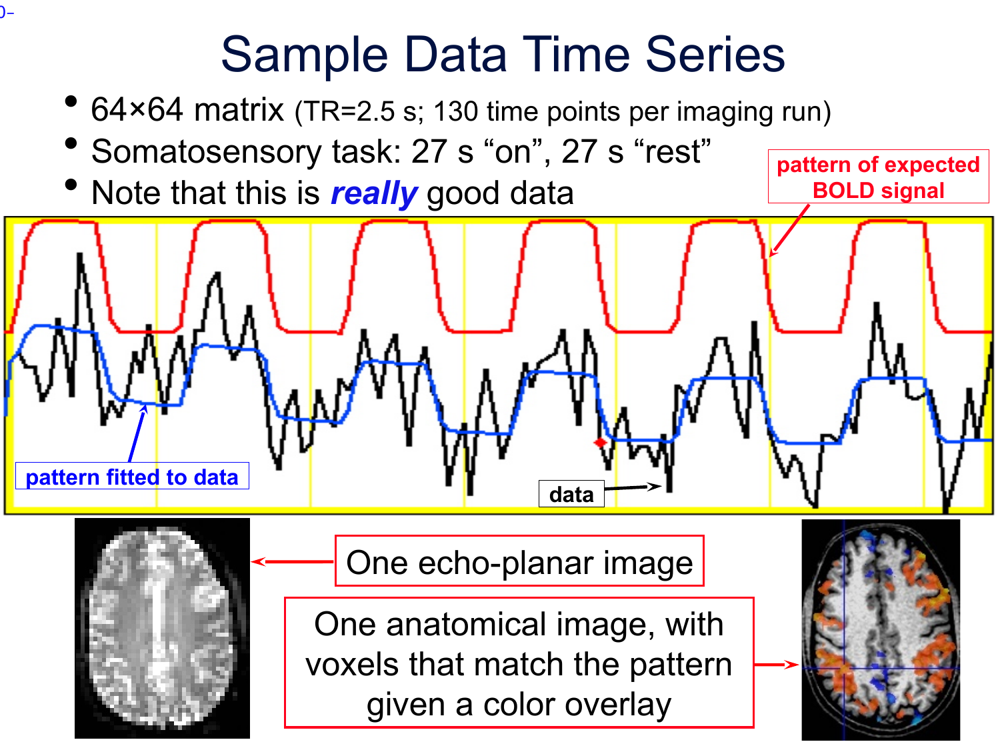

# Lecture 1 — Intro to AFNI and FMRI Data

**Official PDF:** [afni01_intro.pdf](https://afni.nimh.nih.gov/pub/dist/edu/data/CD.expanded/afni_handouts/afni01_intro.pdf)

This is the lecture where we *don't* open the GUI yet. Before any of AFNI's tools make sense, you need to know two things: (1) what signal AFNI is built to analyze (BOLD, its shape in time, and how we find it), and (2) how AFNI represents that signal on disk and in memory. Everything in later lectures — the viewer, regression, alignment, group analysis — is just navigation on top of those two things.

---

## What AFNI is (the 90-second version)

- Written by **Bob Cox** (SSCC, NIMH) starting in **1994**. Still actively developed.
- Name confusion to resolve up front: **AFNI** means two things.
    - Lowercase `afni` — a single GUI program (the viewer).
    - Uppercase AFNI — the full software package: 750+ command-line tools plus the viewer.
- Free, open source (GPL-2), [on GitHub](https://github.com/afni/AFNI).
- Design principles you'll feel throughout the week:
    - Stay close to the data. Every intermediate is inspectable — no black boxes.
    - Give you the pieces, not a policy. You assemble the pipeline.
    - Educate aggressively (that's why this bootcamp exists).

!!! note "Compared to FSL / SPM / MRtrix"
    FSL and SPM ship more opinionated pipelines — "here is *the* way." AFNI gives you sharp tools and expects you to learn how they combine. Steeper initial curve, more control at the end.

---

## What BOLD actually is (the signal AFNI analyzes)

MRI doesn't measure neurons. It measures water — specifically, how hydrogen nuclei (protons) in water behave in a magnetic field. When a brain region works harder, the local blood flow increases a few seconds later. More blood = more oxygenated hemoglobin relative to deoxygenated hemoglobin. That shift changes the local magnetic susceptibility, which changes the MRI signal by **a few percent**.

Key takeaways, because they shape every design decision later:

1. **BOLD is indirect.** You're not seeing neurons firing. You're seeing a blood-flow proxy for neuronal activity. Anything else that changes blood flow (caffeine, breathing, heart rate, vascular anatomy) also moves the signal.
2. **The signal is tiny.** A few percent. Everything that follows — motion correction, nuisance regression, careful design — exists because this signal is fighting physiological noise and scanner drift of similar magnitude.
3. **It's slow.** The blood response lags neural firing by ~2 seconds and persists for ~30 seconds. This is the single most constraining fact about fMRI.

That "slow, smeared-out blood response" has a characteristic shape. Meet it now:

---

## The hemodynamic response function (HRF) — see the shape

{ width=600 }

Look at that blue curve. You need to internalize this shape — it shows up *everywhere* in fMRI.

Read it left-to-right:

| Letter | What's happening |
|:-:|---|
| **A** | Baseline — neuron at rest, BOLD at resting level |
| **B** | Neurons are firing (20 seconds' worth, in this cartoon) |
| **C** | ~2 second delay before blood even *starts* to respond |
| **D** | BOLD climbs over ~15 seconds |
| **E** | Plateau — near-peak for ~5 seconds |
| **F** | BOLD falls over ~15 seconds |
| **G** | Often a brief undershoot *below* baseline before recovery |

So: a stimulus that lasts 20 seconds produces a BOLD response that takes ~30 seconds to play out. That's why fMRI experiments are designed with long blocks or with spaced events — faster than that and the responses run into each other (we'll come back to this).

!!! tip "The single most useful fact on this page"
    The BOLD response to an event lasts ~30 seconds. The neural event itself might be milliseconds. **You are always looking at a smeared, delayed echo.**

---

## From a stimulus to a predicted BOLD signal — what "convolve" means

Here's the puzzle. You design an experiment where, say, a checkerboard flickers on for 20 s, rests for 20 s, flickers for 20 s, etc. That stimulus timeline is a simple on/off square wave:

```
stimulus:   ▁▁▁▁▁▁▁▁▁▁▁███████████████████▁▁▁▁▁▁▁▁▁▁███████████████████▁▁▁▁▁▁▁▁▁
time →      0         20 s                40                 60                80
```

But as we just said, the BOLD signal is slow. The *measured* BOLD in visual cortex isn't going to be a square wave — it'll rise gradually when the stimulus starts and fall gradually when it ends, shaped by the HRF.

So: given your on/off stimulus and the HRF shape, what does the *predicted* BOLD signal look like?

The answer is: the predicted BOLD is the stimulus timeline **convolved** with the HRF.

### Convolution, concretely

Convolution sounds like jargon; the idea is simple. Think of striking a bell.

- One strike → the bell rings with a fixed decaying "shape" over a few seconds.
- Strike it twice, half a second apart → while the first strike's ring is still decaying, the second strike adds a new ring on top. The sound you hear is the *sum* of both rings at each moment.
- Strike it 20 times in a row → you're hearing a rich overlap of 20 rings, each delayed from its strike, all summing up over time.

That process — at every instant, sum up the contributions from each past "strike," each delayed and shaped by a fixed response function — **is convolution.**

In fMRI:

- "Strikes" = the stimulus timeline (the 1s in the on/off square wave, or the event onsets)
- "Ring shape" = the HRF
- "Sound you hear" = the predicted BOLD signal in a voxel that responds to this stimulus

When the stimulus is a long block (20 s of "on"), the convolved BOLD doesn't look like a square wave — it looks like a ramp up, a rounded plateau, a ramp down, and maybe an undershoot. That's the HRF shape smoothed out over the block.

!!! note "This is why fMRI experiments don't pack stimuli too tight"
    If events are less than ~6 seconds apart, their HRF responses overlap heavily and the regression has a hard time telling them apart. Event-related designs carefully space events; block designs embrace the overlap by keeping long, homogeneous blocks.

---

## Finding activation — one voxel at a time

Now the trick. We have, for each voxel:

- The **measured** BOLD timeseries — noisy, drifting, contaminated by motion, physiology, scanner.
- The **predicted** BOLD timeseries — the stimulus convolved with the HRF. Same length, same TR grid.

At each voxel, we ask: *how well does the measured signal track the predicted signal?* If the match is good, this voxel cares about the stimulus. If the match is poor (or the voxel's timeseries is just noise), this voxel does not.

Mechanically, we fit a linear regression at each voxel:

$$\text{measured}(t) \;=\; \beta \cdot \text{predicted}(t) \;+\; (\text{nuisance terms}) \;+\; \text{noise}(t)$$

Two quantities drop out of that fit that you'll see everywhere:

- **β (beta)** — the regression slope. How much of the predicted signal is present in this voxel. Big β = strong response to the stimulus.
- **t-statistic** — β divided by its own standard error. It answers "is this β reliably different from zero, or is it probably noise?" High t = unlikely to be noise.

An **activation map** is just: at every voxel, compute the t-statistic, then color the voxels whose t crosses some threshold. That colored map gets overlaid on an anatomical.

{ width=700 }

Look at the image. The red curve is the predicted BOLD from a 27-s-on / 27-s-off somatosensory task — note how smooth and rounded it is, not a square wave. The black is what this particular voxel actually measured: noisy, but clearly tracking the red. The blue is the regression's best fit to the black using the red as a predictor. The fact that red and blue look similar is *why* we'd say this voxel is activated.

### "Isn't this just checking if things are connected?"

Good instinct but no — this is a different question. Two common-but-distinct fMRI questions:

- **Task activation** (what we just did) — compare a voxel's timeseries to an *externally specified predictor* (the convolved stimulus). Question: "does this voxel respond to my experimental manipulation?"
- **Functional connectivity** — compare *two brain regions' timeseries to each other*. Question: "do these two regions fluctuate together?" Often done at rest (no task), and it's a whole separate world we won't touch on Day 1.

Everything we build through Lecture 3 is task activation. Connectivity comes later in the bootcamp.

---

## AFNI's data model — slowly

Now switch gears from signal to data. Everything we just described — voxels, 3D brains, timeseries — has to live somewhere on disk and in memory. Here's how AFNI organizes it.

### Start with one volume

When the scanner produces one 3D image of the head (one anatomical, or one EPI timepoint), what comes out is:

- A **grid of voxels** — for a T1, maybe 256 × 256 × 175 voxels of roughly 1 mm each.
- **One number per voxel** — the signal intensity at that location.

So conceptually: a single cube of numbers.

{ width=400 }

But raw numbers aren't enough. A cube of numbers with no context is meaningless — you can't tell which cube of numbers is *where in the head*. You need extra information. That extra information is called the **header**:

- Voxel size in mm (how big is each little cube).
- Orientation — which direction is x going? Left-to-right? Front-to-back? This is encoded as a 3-letter code like `RAI`.
- Origin in scanner coordinates — where does voxel (0, 0, 0) sit in physical space.
- If there's a time dimension: TR (seconds between volumes).
- Plus labels and stats parameters we'll see shortly.

**Grid of numbers + header = one AFNI dataset.** That's actually it. Hold onto that definition — we're about to extend it.

{ width=600 }

### What if you have more than one volume? (This is the sub-brick idea.)

Now imagine an fMRI run. You're scanning the same head every 2 seconds for 5 minutes. You get 150 separate 3D volumes, indexed by time.

AFNI bundles them into **one** dataset. The 150 volumes inside are called **sub-bricks**, indexed 0, 1, 2, …, 149. Sub-brick #0 is the first volume; sub-brick #149 is the last.

{ width=500 }

That's the picture. **A dataset is a stack of sub-bricks; each sub-brick is a 3D volume; all sub-bricks in a dataset share the same voxel grid.**

### But sub-bricks don't *have* to be time

This is where it generalizes. AFNI uses sub-bricks any time it needs to group multiple 3D volumes that share a grid. Time is just the most intuitive case. Here are the main cases you'll hit:

| What's in the dataset | What each sub-brick represents | How many sub-bricks |
|---|---|:-:|
| An EPI timeseries | One volume = one scanner timepoint (one TR) | 100s |
| A T1 anatomical | Just one volume — the structural | 1 |
| A brain mask | Just one volume — integer labels (0 = background, 1 = brain) | 1 |
| A multi-region ROI atlas | One volume — integer labels, one ID per region | 1 |
| A mean EPI (average across time) | Just one volume — the mean image | 1 |
| A regression output (from `3dDeconvolve`, Lecture 2) | One sub-brick *per statistical quantity*: a β for each regressor, a t-stat for each regressor, an F-stat, etc. | 10s–100s |

The regression case is worth sitting with for a moment. When we run the task-activation regression in Lecture 2, the output isn't "one file of betas and one file of t-stats." It's **one dataset** — e.g. `stats.FT+tlrc` — with a β sub-brick, a t-stat sub-brick, an F-stat sub-brick, and so on, each with a human-readable **label**. You'll reference them by label:

```text
stats.FT+tlrc[Vrel#0_Coef]       ← the β for the "visual reliable" condition
stats.FT+tlrc[Vrel#0_Tstat]      ← the t-stat for the same condition
```

Why group them all into one dataset? Because they share a grid, a mask, and a provenance (they all came from the same regression run). Splitting them into separate files means bookkeeping later to keep them in sync. Bundling them in one dataset is AFNI's way of saying "these numbers belong together."

### Image dataset vs. derived dataset

The last conceptual split. The voxel values in a dataset can come from two places:

- **Image dataset** — the numbers are scanner intensities. Examples: `FT_anat+orig` (one T1 scan), `FT_epi_r1+orig` (152 EPI volumes). These are what the scanner produced, possibly after conversion from DICOM.
- **Derived dataset** — the numbers are computed from other datasets. Examples: a brain mask (1 where brain, 0 where not), a mean EPI (mean across time), a t-stat map (output of regression).

AFNI does not care which kind you hand it. `3dinfo`, `3dcalc`, the GUI, the arithmetic — they all operate uniformly on any dataset. "Image" vs "derived" is a provenance distinction for the human, not a file-format distinction.

### Indexing sub-bricks at the shell

Last vocab piece. To reference sub-brick 3 of a dataset at the shell:

```bash
dataset_name+view'[3]'
```

Two important bits:

1. `+view` is part of the dataset name — either `+orig` (scanner space) or `+tlrc` (aligned to a template). More below.
2. The single quotes around `[3]` are required. Bash/zsh treat `[` as glob syntax — the quotes tell the shell "leave these brackets alone, they're for AFNI."

You can also use labels where they exist:

```bash
stats.FT+tlrc'[Vrel#0_Coef]'
```

Or ranges: `FT_epi_r1+orig'[0..9]'` grabs the first 10 sub-bricks.

---

## File formats on disk

### BRIK + HEAD (the AFNI native format)

A single AFNI dataset on disk is **two files**:

```text
FT_anat+orig.HEAD     ← ASCII text: the header info (dimensions, orientation, labels, …)
FT_anat+orig.BRIK     ← raw binary: the voxel numbers for all sub-bricks
                        (often .BRIK.gz when compressed)
```

They always travel together. Lose one and the other is useless. When you `cp` or `mv`, take both.

You can `head` the `.HEAD` file — it's plain ASCII key/value records. You generally shouldn't *edit* it by hand (there's a dedicated tool called `3drefit` for that), but you can read it to see what AFNI is storing.

### The "view" tag

Look at the filename — `FT_anat+orig`. The `+orig` is a **view tag**: it says what coordinate system this dataset lives in.

- `+orig` — original scanner space. What the scanner gave you, possibly reoriented.
- `+tlrc` — aligned to a standard atlas (Talairach, MNI, etc.). Moved + rescaled to a common template space so you can compare across subjects.

You typically acquire data in `+orig` and *transform* it into `+tlrc` as part of preprocessing (Lecture 5). For now just know: the view is baked into the filename.

### NIfTI

The rest of the field (FSL, SPM, Python/`nibabel`, BrainVoyager) uses the NIfTI format (`.nii` or `.nii.gz`) — a single file combining header and data. AFNI reads and writes it natively. To make any AFNI program write NIfTI instead of BRIK/HEAD, just end your `-prefix` in `.nii` or `.nii.gz`:

```bash
3dcalc -a FT_anat+orig -expr 'a' -prefix anat_copy.nii.gz    # writes NIfTI
3dcalc -a FT_anat+orig -expr 'a' -prefix anat_copy           # writes anat_copy+orig.HEAD / .BRIK
```

!!! tip "When to use which"
    Stay in BRIK/HEAD inside an AFNI pipeline — richer per-sub-brick metadata (labels, stat params) that NIfTI doesn't cleanly support. Export to NIfTI when you hand data off to a non-AFNI tool or share publicly.

### Other formats

AFNI can *read* ANALYZE 7.5 (`.hdr`/`.img`), MINC-1 (`.mnc`), CTF MEG, and ASCII (`.1D`) — plain-text columns of numbers, which you'll meet when we write stimulus timing files in Lecture 2/3.

---

## AFNI's program landscape

You'll interact with AFNI in three modes:

1. **The GUI** — the program literally named `afni`. Interactive viewer, crosshair, stats overlays. Lectures 3 and 4.
2. **Batch programs** — one-shot command-line tools. *Almost all real work happens here.* Naming convention: programs starting with `3d` operate on 3D datasets (`3dinfo`, `3dcalc`, `3dDeconvolve`, `3dvolreg`, `3dSkullStrip`, …).
3. **Super-scripts** — Python wrappers that chain many `3d*` programs into a full pipeline. Two you'll use constantly:
    - `afni_proc.py` — end-to-end single-subject preprocessing + first-level GLM.
    - `align_epi_anat.py` — EPI ↔ anatomical coregistration (Lecture 5).

!!! tip "This maps directly to your DTI experience"
    Your DTI pipeline was a shell script calling `dwidenoise`, `dwifslpreproc`, `dwibiascorrect`, `dwi2tensor`, etc. `afni_proc.py` is the AFNI analog: each of its flags maps to a specific `3d*` call. Bonus: it writes out the full tcsh pipeline script for you to read, tweak, and rerun. We'll dissect one in Lecture 3.

**A starter set of `3d*` programs** — you don't need to memorize these, but see the naming pattern:

| Program | What it does |
|---|---|
| `3dinfo` | Dump a dataset's header. Your most-used command, hands down. |
| `3dcalc` | Voxel-wise calculator. `3dcalc -a X -b Y -expr 'a-b' -prefix diff` to subtract two datasets. |
| `3dDeconvolve` | Linear regression / GLM on 3D+time data (Lecture 2). |
| `3dREMLfit` | Same GLM with a better (ARMA) noise model. Runs after `3dDeconvolve`. |
| `3dvolreg` | Motion correction — register every sub-brick to a reference. |
| `3dresample` | Re-orient or re-grid a dataset. |
| `3dSkullStrip` | Strip skull from T1. |
| `3dANOVA` / `3dLME` | Group-level statistics. |
| `3dDWItoDT` | DTI tensor fit (AFNI has DTI tools too). |

**SUMA** is worth naming: it's the AFNI *surface* viewer. It renders cortical meshes (from FreeSurfer / BrainVoyager / Caret) and can "talk" to an open `afni` session so clicking in one jumps the other. We won't use SUMA on Day 1.

---

## Hands-on — `3dinfo` on real data

Concepts are set. Now we put eyes on real datasets on the cluster and make the abstractions concrete. This is a ~10-minute exercise.

### 1. Connect to the cluster

From your Mac terminal (Temple VPN connected):

```bash
expect -c '
spawn ssh -o StrictHostKeyChecking=no tur50045@155.247.67.31
expect "password:"
send "Milolab123!\r"
interact
'
```

Inside, confirm AFNI is on `PATH`:

```bash
afni -ver
# → Precompiled binary linux_ubuntu_16_64: May 23 2025 (Version AFNI_25.1.11 'Maximinus')
```

If that errors, `source ~/.bashrc` and try again.

### 2. Walk to the canonical "FT" dataset

"FT" is the example subject you'll see throughout the AFNI bootcamp. Three runs of a visual/auditory paradigm, plus a T1 anatomical.

```bash
cd /data/AFNIBootcamp_2025/CD/AFNI_data6/FT_analysis/FT
ls *.HEAD
# → FT_anat+orig.HEAD  FT_epi_r1+orig.HEAD  FT_epi_r2+orig.HEAD  FT_epi_r3+orig.HEAD
```

Four datasets — one anatomical, three EPI runs. Each has its matching `.BRIK` (or `.BRIK.gz`) right next to it.

### 3. Inspect the anatomical

```bash
3dinfo -verb FT_anat+orig | head -20
```

Look at the output against everything above. You should find:

- `Dataset Type: Anat Bucket (-abuc)` — AFNI has tagged this as an anatomical.
- `Data Axes Orientation: [-orient ASL]` — axes go Anterior-to-Posterior, Superior-to-Inferior, Left-to-Right. Sagittal slicing. (Not every dataset is RAI — real-world orientations are whatever the scanner sat in.)
- `256 × 256 × 175` voxels at `0.938 × 0.938 × 1.000 mm` — near-isotropic, high-res T1.
- `Number of values stored at each pixel = 1` — **one sub-brick.** As expected for a single structural scan.

### 4. Inspect an EPI run

```bash
3dinfo -verb FT_epi_r1+orig | head -25
```

Compare against the anatomical:

- `Dataset Type: Echo Planar (-epan)`.
- `80 × 80 × 33` voxels at `2.75 × 2.75 × 3.0 mm` — much coarser resolution, because we're trading spatial detail for temporal speed.
- `-orient RAI` — different from the anatomical's ASL. Lecture 5 is about reconciling these.
- `Number of time steps = 152  Time step = 2.00000s` — **152 sub-bricks, TR = 2 s.** Scroll the output and you'll see them enumerated: `sub-brick #0`, `#1`, …, `#151`. Each one is a full 3D EPI volume at a different instant in time.

### 5. Extract a specific sub-brick

You can ask questions about a single sub-brick without copying anything:

```bash
3dinfo -nv  FT_epi_r1+orig              # just the number of sub-bricks
3dinfo -tr  FT_epi_r1+orig              # just the TR
3dBrickStat -mean  FT_epi_r1+orig'[0]'    # mean intensity of volume 0
3dBrickStat -mean  FT_epi_r1+orig'[75]'   # mean intensity of volume 75
```

Notice the single quotes around `[0]` — that's shielding the brackets from the shell. Forget them and you'll get a glob error like `no matches found`.

### 6. Read the raw HEAD file

```bash
head -40 FT_anat+orig.HEAD
```

ASCII key/value records. You can see, literally, what AFNI stores. You normally wouldn't edit this by hand — `3drefit` is the tool — but it's useful to know it's just text.

---

## Checkpoint questions

Answer before scrolling back.

1. **Why does the BOLD signal lag the neural event by seconds, even though neurons fire in milliseconds?**

    ??? answer "Show answer"
        BOLD is a *hemodynamic* (blood-flow) proxy, not a direct neural measurement. Blood flow takes ~2 seconds to increase locally after neurons fire, then persists for tens of seconds. You're always seeing a smeared, delayed echo of neural activity.

2. **In one or two sentences, what is the "predicted BOLD timeseries" and how do we get it?**

    ??? answer "Show answer"
        Take your stimulus timeline (on/off at each timepoint) and *convolve* it with the HRF (the canonical rising-plateau-falling shape). That gives you a smoothed, delayed signal representing what a BOLD-responsive voxel *should* look like if it cares about your stimulus.

3. **What is β (beta) at a voxel, and what is t at that voxel? What would a big β with a small t mean?**

    ??? answer "Show answer"
        β is the regression slope — how much of the predicted signal is present in this voxel's measured signal. t is β divided by its standard error — how confident we are that β isn't just noise. Big β with small t means "we estimated a large response, but our uncertainty around that estimate is also large, so we can't rule out zero." Typically happens with short runs or very noisy voxels.

4. **A mask dataset, a T1 anatomical, and an EPI timeseries are all "AFNI datasets." What's the same about them, and what's different?**

    ??? answer "Show answer"
        Same: each is a 3D grid of voxels plus a header, stored as `.HEAD` + `.BRIK`. All AFNI programs (`3dinfo`, `3dcalc`, the GUI) operate on them uniformly. Different: the number and meaning of sub-bricks. Mask and T1 each have one sub-brick (one 3D volume); the EPI has many (one per TR). The voxel values also mean different things (integers for a mask, scanner intensity for the T1, scanner intensity per timepoint for the EPI).

5. **The regression output dataset `stats.FT+tlrc` has ~40 sub-bricks. Why so many, and why are they in one dataset instead of split into separate files?**

    ??? answer "Show answer"
        Regression at each voxel produces several statistical quantities *per predictor* — at minimum a β and a t-stat, often plus an F-stat, and typically more than one predictor (multiple conditions, contrasts, basis functions). All of these share the same voxel grid and the same provenance (same regression run), so AFNI bundles them into one dataset with human-readable labels. Splitting them into separate files would force you to keep them in sync manually forever.

6. **You type `3dinfo FT_epi_r1+orig[0]` and get an error. Why, and how do you fix it?**

    ??? answer "Show answer"
        Zsh/bash saw the `[` and tried to glob-expand it. Single-quote the brackets: `3dinfo 'FT_epi_r1+orig[0]'` or `3dinfo "FT_epi_r1+orig[0]"` or the more common `3dinfo FT_epi_r1+orig'[0]'`.

7. **Task activation and functional connectivity are both "fMRI analyses," but they ask different questions. What are those questions, in one sentence each?**

    ??? answer "Show answer"
        Task activation: "does this voxel's timeseries match a predicted signal derived from my experimental stimulus?" Functional connectivity: "do these two voxels' (or regions') timeseries covary with each other, independent of any external stimulus?"

---

## Exit criteria

Before Lecture 2, you should be able to:

- [x] Draw the HRF and label its phases (delay, rise, plateau, fall, undershoot).
- [x] Explain *in your own words* what convolving a stimulus with an HRF does, and why the predicted BOLD isn't a square wave even when the stimulus is.
- [x] Define β and t at a voxel, and describe what an activation map is.
- [x] Distinguish task activation from functional connectivity.
- [x] Read a `3dinfo` output and identify orientation, voxel size, TR (if 3D+time), and number of sub-bricks.
- [x] Describe what a sub-brick is, and give three different things a sub-brick can represent.
- [x] Explain why BRIK/HEAD is two files and why losing one orphans the other.

Got them all? Onward to [Lecture 2 — Regression, Part 1](02-regression-part1.md), where we formalize the regression we just described and get concrete about `3dDeconvolve`.
